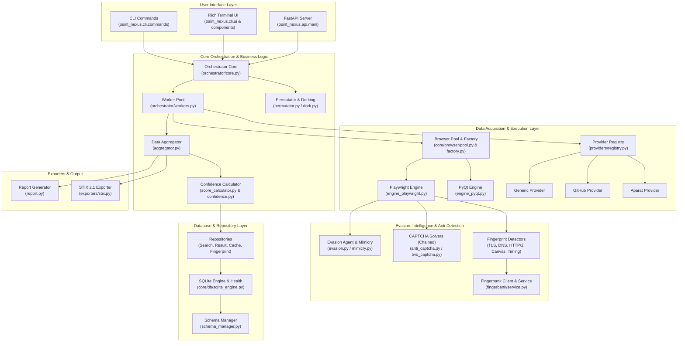
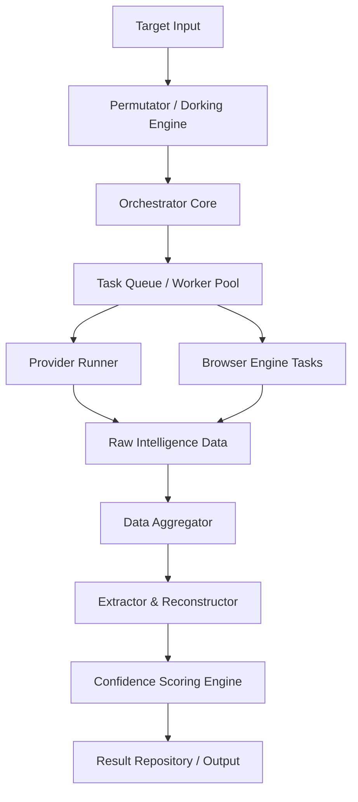
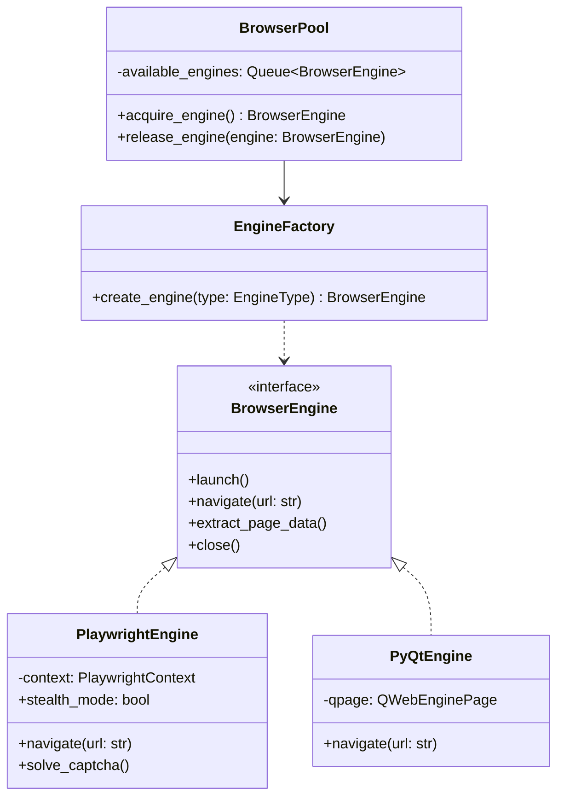
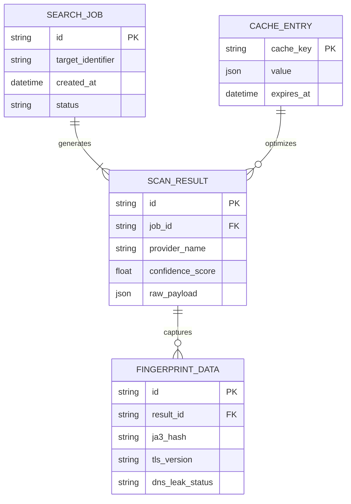
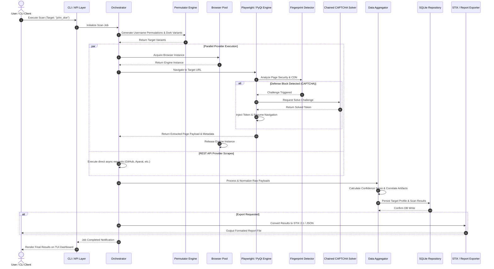

### OSINT-Nexus 

* Powered by FJ™ Cyberzilla Systems®
*FJ-cyberzilla* dev and  owner of the following  Platform.

## Architectural Blueprint & System Specification

## 1. Executive Summary & Core Purpose

`osint-nexus` is an enterprise-grade, highly modular Open Source Intelligence (OSINT) gathering, browser automation, and digital fingerprinting framework designed in Python. It provides automated target reconnaissance, dynamic content extraction, anti-bot/anti-scraping evasion, network & protocol-level fingerprint detection, multi-provider API integrations, and structured intelligence exports (e.g., STIX 2.1).

### Key Architectural Pillars
1. **Multi-Head Execution Engine**: Headless browser automation engine powered by Playwright and PyQt backends with automatic dynamic engine fallback and pooling.
2. **Detection & Evasion Subsystem**: Real-time fingerprint analysis (TLS, HTTP/2, TCP, DNS, Canvas/Audio, Timing/Entropy) coupled with adaptive mimicry and active CAPTCHA solving (Anti-Captcha, 2Captcha, Chained solvers).
3. **Orchestrated Recon Pipeline**: Asynchronous worker pool system running permutation, target discovery, dorking, data extraction, and confidence scoring.
4. **Data Persistence & Health Monitoring**: Multi-tier repository pattern using SQLite engines, cache layers, schema migration handlers, and diagnostic telemetry probes.
5. **Multi-Interface Access**: Terminal UI (Rich/Textual), CLI commands, and a RESTful API layer (FastAPI).

---

## 2. High-Level Architecture Diagram

The diagram below illustrates the macro-level view of `osint-nexus`, showing user interface entry points, core orchestration modules, data acquisition engines, evasion layers, storage abstractions, and export formats.



---

## 3. Layer Breakdown & Core Modules

### 3.1 Interface Layer (`osint_nexus/cli`, `osint_nexus/api`)
- **CLI Commands (`osint_nexus/cli/commands/`)**:
  - `scan.py`: Initiates multi-threaded scan jobs against target usernames, domains, or IP addresses.
  - `health.py`: Executes system readiness checks, browser health validations, and API key authentications.
  - `db_info.py`: Inspects internal storage usage, schema migration state, and cached query metrics.
- **UI Components (`osint_nexus/cli/components/`)**:
  - Provides modular UI elements (progress bars, status panels, tabular results, credential input prompts) styled via `theme.py`.
- **API Server (`osint_nexus/api/`)**:
  - Exposes RESTful endpoints (`main.py`) using Dependency Injection (`deps.py`) to allow remote management and programmatic integration.

### 3.2 Core Orchestration Subsystem (`osint_nexus/core/`)



- **Orchestrator (`orchestrator/core.py`, `workers.py`)**: Manages the execution lifecycle. Spawns asynchronous task workers, schedules platform-specific checks, and manages resource concurrency limits.
- **Aggregator (`aggregator.py`)**: Merges partial intelligence artifacts collected from standard web requests, headful/headless browsers, and third-party APIs.
- **Confidence & Scoring Engine (`confidence.py`, `score_calculator.py`)**: Evaluates the probability of target matches, discounting false positives via cross-referencing and contextual heuristics.
- **Permutation Engine (`permutator.py`, `platform_permutator.py`)**: Generates variations of target usernames, handles, domains, and dork queries based on platform-specific rules.

### 3.3 Browser Automation & Protocol Evasion (`osint_nexus/core/browser/`, `evasion.py`)

The framework abstracts browser runtime engines, selecting between Playwright and PyQt depending on platform capabilities, system dependencies, or anti-bot defenses.



- **Browser Detector & Evasion (`evasion.py`, `mimicry.py`)**: Modifies HTTP request headers, TLS client handshakes, navigator properties, canvas fingerprints, and WebGL context to bypass fingerprinting mechanisms.
- **Detectors (`osint_nexus/core/detectors/`)**: Analyzes defensive controls on target servers:
  - `cdn.py`: Detects Cloudflare, Akamai, Imperva, AWS CloudFront.
  - `tls.py` & `http2.py`: Analyzes JA3/JA4 fingerprints and HTTP/2 settings frames.
  - `timing_entropy.py`: Analyzes wall-clock timing variations for side-channel defense detection.
- **CAPTCHA Solvers (`osint_nexus/core/captcha/`)**:
  - `chained.py`: Enables automated fallback sequences (e.g., attempt local OCR -> `anti_captcha.py` -> `two_captcha.py`).

### 3.4 Storage & Intelligence Persistence (`osint_nexus/core/db/`)

Persistence relies on SQLite via an optimized repository abstraction layer.



- **Schema Manager (`schema_manager.py`)**: Handles zero-downtime database upgrades and table versioning.
- **Health Manager (`health_manager.py`)**: Tracks database file lock contention, read/write latency, and transaction integrity.
- **Repositories**: Specialized classes for caching (`cache_repository.py`), fingerprint tracking (`fingerprint_repository.py`), target queries (`search_repository.py`), and result persistence (`result_repository.py`).

---

## 4. End-to-End Scan Execution Flow

The sequence diagram below models the execution flow when a scan request is executed through the framework.



---

## 5. Complete Repository File & Directory Map

| Path | Purpose / Description |
| :--- | :--- |
| **`CODEOWNERS`** | Defines project ownership and pull-request review rules. |
| **`DISCLAIMER` / `NOTICE`** | Legal usage notices regarding security auditing and OSINT ethics. |
| **`Makefile`** | Build automation tasks (linting, tests, environment setup). |
| **`pyproject.toml` / `uv.lock`** | Dependency declarations and lockfiles for environment reproducibility. |
| **`data/`** | Static data assets (MAC OUI databases, site definitions, user-agent pools). |
| **`docs/`** | Architectural documentation, mermaid specs, and developer guidelines. |
| **`osint_nexus/api/`** | FastAPI endpoints (`main.py`) and dependency injection providers (`deps.py`). |
| **`osint_nexus/cli/`** | Terminal User Interface dashboard, Rich components, and executable commands. |
| **`osint_nexus/core/browser/`** | Playwright and PyQt browser automation engines, pooling, and factory logic. |
| **`osint_nexus/core/captcha/`** | Modular CAPTCHA solvers (2Captcha, Anti-Captcha) and solver registries. |
| **`osint_nexus/core/db/`** | SQLite abstraction layers, migrations, and repository patterns. |
| **`osint_nexus/core/detectors/`** | Protocol-level fingerprint detectors (TLS, HTTP/2, DNS leaks, Canvas, Timing). |
| **`osint_nexus/core/exporters/`** | Exporters converting output into standardized formats (STIX 2.1). |
| **`osint_nexus/core/fingerbank/`** | Device, operating system, and hardware inference engines. |
| **`osint_nexus/core/orchestrator/`** | Asynchronous worker pool dispatcher and job state managers. |
| **`osint_nexus/core/telemetry/`** | Internal diagnostics, system telemetry probes, and bridge utilities. |
| **`osint_nexus/providers/`** | Provider implementations for target platforms (GitHub, Aparat, Generic web). |
| **`osint_nexus/utils/`** | Rate limiters, security sandboxes, network monitors, and string parsers. |
| **`scripts/`** | Diagnostic scripts for type-checker verification (`repro_*`). |
| **`tests/`** | Full unit, functional, integration, and mock test suites. |

---

## 6. Setup & Developer Quickstart

### Prerequisites
- Python 3.10+
- `uv` or `pip` package manager
- Node.js / Playwright browser binaries (for full headful/headless engine capabilities)

### Installation & Initialization
```bash
# Clone the repository
git clone [https://github.com/org/osint-nexus.git](https://github.com/org/osint-nexus.git)
cd osint-nexus

# Setup environment with uv
uv sync

# Install Playwright browser dependencies
npx playwright install webkit chromium firefox

# Run health diagnostics
python -m osint_nexus.cli.main health
```

### Running Scans via CLI
```bash
# Run reconnaissance on a target handle
python -m osint_nexus.cli.main scan --target "john_doe" --export stix

# Run API Server
uvicorn osint_nexus.api.main:app --reload --port 8000
