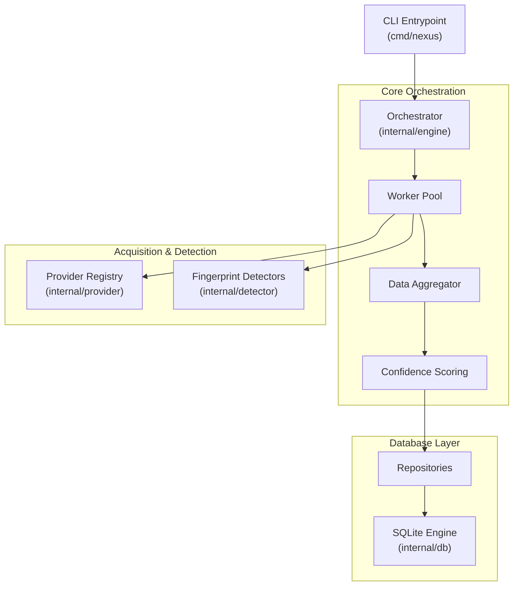

# OSINT Nexus - Architectural Blueprint (Go Edition)

## 1. Executive Summary & Core Purpose

`osint-nexus` is an enterprise-grade, highly modular OSINT gathering and digital fingerprinting framework, migrated to native Go (`go1.23+`). It provides automated target reconnaissance, dynamic content extraction, low-level protocol analysis, and multi-source pivot extraction.

### Core Architectural Pillars
1. **Low-Level Protocol Engine**: Deep packet inspection, custom TLS fingerprinting (JA3/JA4), DNS record traversal, and raw socket manipulation.
2. **Orchestrated Recon Pipeline**: Asynchronous worker pool system running permutation, target discovery, data extraction, and confidence scoring.
3. **Data Persistence**: Repository pattern using SQLite with strict schema management.
4. **Interface Layer**: CLI tool (`cmd/nexus`) for high-performance reconnaissance.

---

## 2. High-Level Architecture Diagram



---

## 3. Core Modules

- **`internal/engine/`**: Manages the execution lifecycle, job scheduling, and worker pool.
- **`internal/detector/`**: Low-level protocol probes (DNS, TLS, HTTP2).
- **`internal/extractor/`**: Modular, streaming-based parsing pipeline (Email, Social, Meta, PGP).
- **`internal/provider/`**: Provider implementations for target platforms.
- **`internal/types/`**: Core domain structs and interfaces ensuring strict type safety.
- **`internal/db/`**: Repository patterns for data persistence.

---

## 4. Development & Coding Standards

### Standards
- **Strict Typing**: No `any` types; concrete structs and interfaces only.
- **Error Handling**: No `panic()`. Explicit error propagation via `fmt.Errorf` and `eris`.
- **Context Management**: All network calls must accept `context.Context`.
- **Performance**: Zero-allocation byte slicing where possible.

### Quickstart
```bash
# Build the project
go build ./...

# Run tests
go test ./...
```
